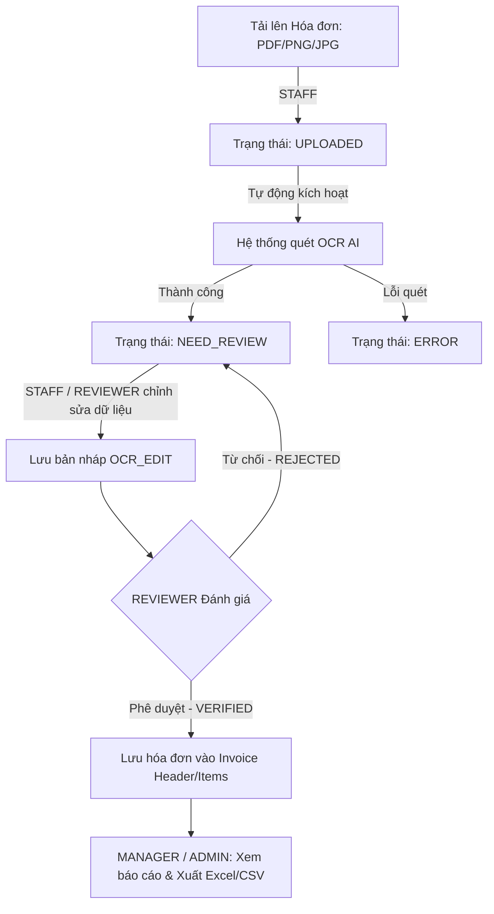
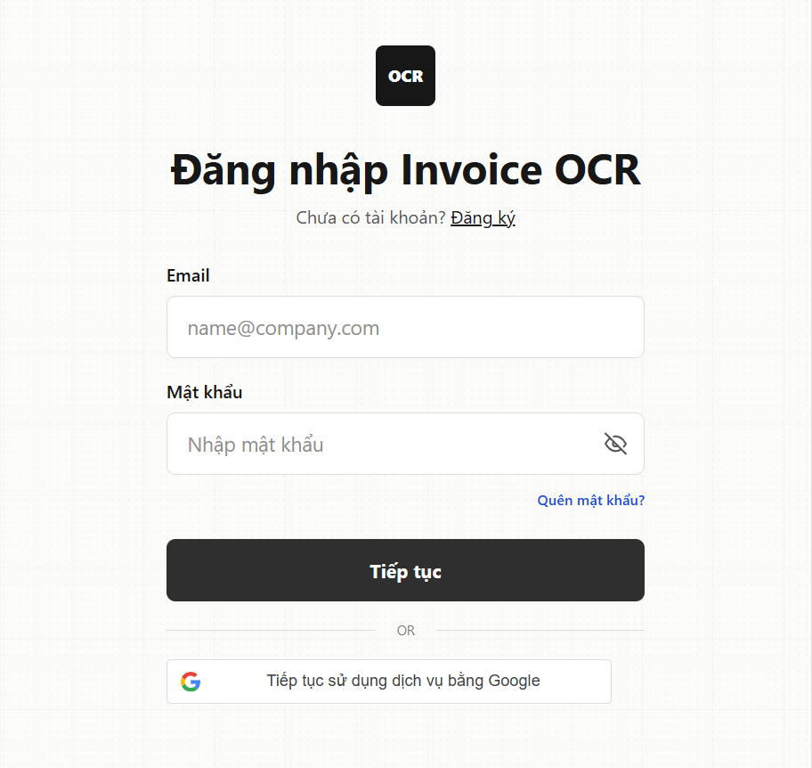
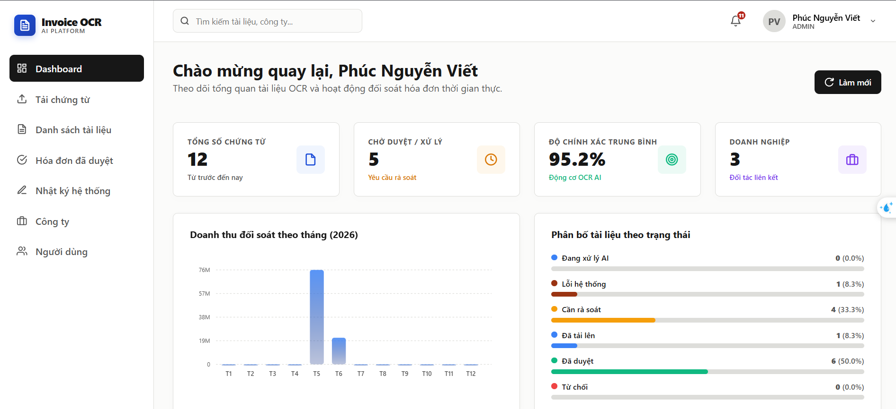
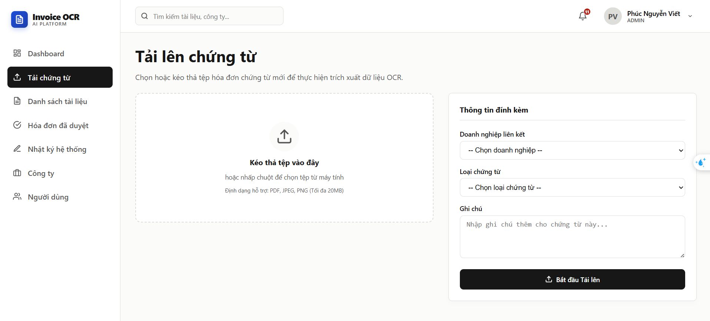
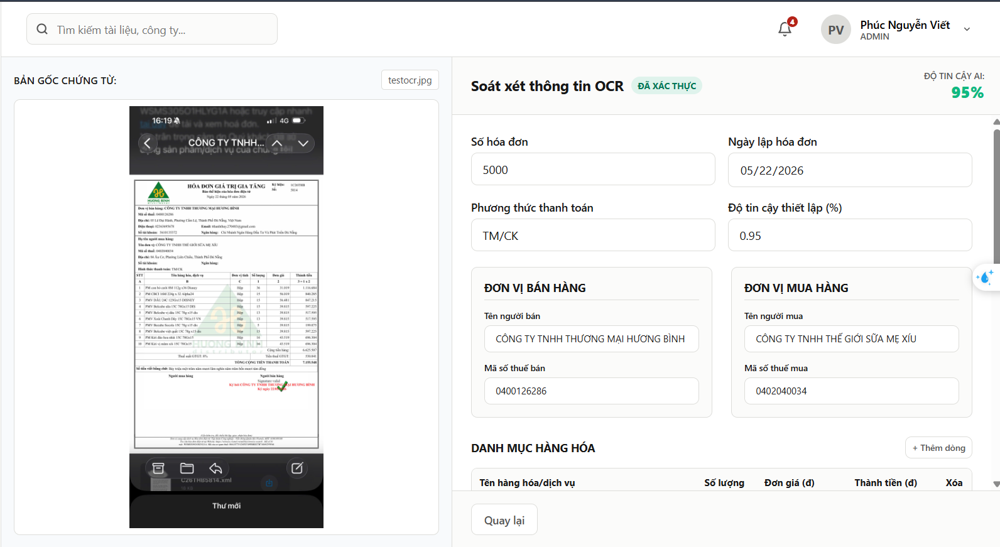
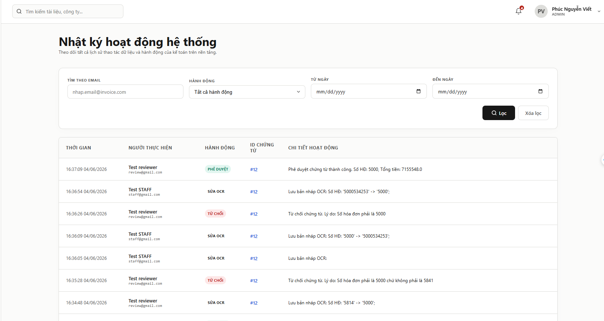

# HỆ THỐNG XỬ LÝ HÓA ĐƠN TỰ ĐỘNG - OCR INVOICE SYSTEM

Hệ thống **OCR Invoice** là một ứng dụng Web toàn diện hỗ trợ các công ty dịch vụ kế toán và phòng tài chính tự động hóa quy trình số hóa, kiểm tra và phê duyệt hóa đơn chứng từ. Bằng việc áp dụng công nghệ Nhận dạng ký tự quang học (OCR) thông qua trí tuệ nhân tạo (AI), hệ thống giúp tối ưu hóa 80% thời gian nhập liệu thủ công và nâng cao độ chính xác của dữ liệu kế toán.

---

## 🌟 Tính Năng Nổi Bật

- 🔐 **Bảo mật & Phân quyền**: Đăng nhập bằng Google SSO, cấp phát token JWT nội bộ và phân quyền chặt chẽ dựa trên vai trò (Role-Based Access Control - RBAC).
- 🤖 **OCR AI Đa Dạng**: Tích hợp linh hoạt các nhà cung cấp OCR (Mock OCR cho chạy thử nghiệm, Gemini API, OpenAI GPT, Groq API).
- 🖥️ **Giao diện Soát xét Trực quan (Double-Pane)**: Hiển thị song song ảnh/file PDF hóa đơn gốc ở bên trái và form dữ liệu số hóa có thể chỉnh sửa ở bên phải.
- 📋 **Quản lý danh mục**: Quản lý nhiều công ty đối tác độc lập và phân loại các loại chứng từ phong phú.
- 📊 **Thống kê & Giám sát**:
  - Dashboard tổng quan số lượng chứng từ theo trạng thái và biểu đồ đo lường hiệu suất của nhân viên.
  - Hệ thống Nhật ký kiểm toán (**Audit Logs**) chi tiết, ghi nhận cụ thể từng hành động thay đổi dữ liệu của người dùng.
- 📤 **Xuất dữ liệu**: Cho phép xuất dữ liệu các hóa đơn đã được phê duyệt sang định dạng CSV/Excel.

---

## 🛠️ Công Nghệ Sử Dụng

### Backend
- **Core Framework**: Spring Boot 3.3.2 (Java 21)
- **Security**: Spring Security + JWT Token + Google OAuth2 Client
- **Data Access**: Spring Data JPA + Hibernate
- **Database**: MySQL 8.0
- **Build Tool**: Maven

### Frontend
- **Framework**: React.js + Vite
- **Routing**: React Router DOM
- **HTTP Client**: Axios
- **State & UI**: CSS Custom Variable (Premium Sleek Theme) & Toastify Notifications

---

## 📐 Kiến Trúc Luồng Tài Liệu (Workflow)



---

## 👥 Vai Trò & Phân Quyền (Roles & Permissions)

Hệ thống được thiết kế với 4 vai trò rõ ràng:

1. **ADMIN (Quản trị viên)**:
   - Quản lý danh sách nhân viên, khóa/mở tài khoản và phân vai trò (`ADMIN`, `STAFF`, `REVIEWER`, `MANAGER`).
   - Quản lý danh mục Công ty khách hàng (Companies) và Loại chứng từ (Doc Types).
   - Truy cập trang **Audit Logs** toàn hệ thống để giám sát bảo mật.
2. **STAFF (Nhân viên nhập liệu)**:
   - Tải lên chứng từ ảnh/PDF và lựa chọn phân loại công ty thụ hưởng.
   - Thực hiện kiểm tra, chỉnh sửa dữ liệu số hóa OCR khi có sai sót và gửi duyệt.
3. **REVIEWER (Kiểm duyệt viên / Kế toán trưởng)**:
   - Xem chi tiết so khớp song song tài liệu gốc và form thông tin.
   - Sửa đổi trực tiếp dữ liệu nếu cần, bấm **Phê duyệt (Verify)** để đẩy vào sổ sách chính thức hoặc **Từ chối (Reject)** kèm lý do.
4. **MANAGER (Quản lý)**:
   - Xem Dashboard biểu đồ thống kê trạng thái hóa đơn và năng suất làm việc của nhân viên.
   - Tra cứu dữ liệu hóa đơn đã duyệt và thực hiện xuất file Excel/CSV.

---

## 🚀 Hướng Dẫn Cài Đặt & Chạy Dự Án

### 1. Chuẩn Bị Môi Trường
- Máy tính đã cài sẵn **Java SDK 21**, **Node.js** và **MySQL Server 8**.

### 2. Cấu Hình Cơ Sở Dữ Liệu (Database)
- Đăng nhập vào MySQL và tạo mới một schema có tên:
  ```sql
  CREATE DATABASE invoice_ocr CHARACTER SET utf8mb4 COLLATE utf8mb4_unicode_ci;
  ```

### 3. Cấu Hình Backend
- Mở file `backend/src/main/resources/application.properties` (hoặc cấu hình các biến môi trường tương ứng):
  ```properties
  # Kết nối database
  spring.profiles.active=local
  spring.datasource.url=jdbc:mysql://localhost:3306/invoice_ocr?useSSL=false&serverTimezone=Asia/Ho_Chi_Minh
  spring.datasource.username=YOUR_MYSQL_USERNAME
  spring.datasource.password=YOUR_MYSQL_PASSWORD

  # Cấu hình Google Client ID (Dùng cho Google SSO)
  app.google.client-id=YOUR_GOOGLE_CLIENT_ID

  # Cấu hình OCR Provider (groq / gemini / openai / mock)
  app.ocr.provider=mock # Hoặc groq, gemini, openai

  # Cấu hình API Key nếu dùng OCR thật
  app.gemini.key=YOUR_GEMINI_API_KEY
  app.groq.key=YOUR_GROQ_API_KEY
  app.openai.key=YOUR_OPENAI_API_KEY
  ```

### 4. Khởi Chạy Backend
```bash
cd backend
mvn clean spring-boot:run
```
*Backend sẽ chạy tại cổng mặc định `http://localhost:8080`.*

### 5. Cấu Hướng & Chạy Frontend
- Mở thư mục frontend, cấu hình tệp `.env` nếu có (để trỏ API URL về `http://localhost:8080/api`).
- Chạy các lệnh sau:
```bash
cd frontend
npm install
npm run dev
```
*Frontend React sẽ khởi động và cung cấp link truy cập (thường là `http://localhost:5173`).*

---

## 📸 Hình Ảnh Giao Diện Demo (Screenshots)

*Dưới đây là một số hình ảnh thực tế từ hệ thống phục vụ quá trình trình bày demo:*

### 1. Màn hình Đăng nhập (Google Single Sign-On)

> Người dùng đăng nhập nhanh chóng bằng tài khoản Google doanh nghiệp để hệ thống tự động xác thực và phân quyền truy cập.

### 2. Giao diện Dashboard Quản lý

> Hiển thị số liệu tổng quan hóa đơn theo trạng thái và biểu đồ trực quan đo hiệu suất làm việc của phòng ban kế toán.

### 3. Trang Tải lên Tài liệu

> Cho phép kéo thả tệp hóa đơn (ảnh/PDF) dung lượng tối đa 20MB, gán nhanh metadata về khách hàng và kích hoạt tiến trình OCR tự động.

### 4. Giao diện Soát xét & So khớp OCR (Double-Pane View)

> Điểm nhấn chính của demo: Xem song song hóa đơn gốc bên trái và biểu mẫu dữ liệu đã trích xuất bên phải. Cho phép chỉnh sửa trực tiếp, hiển thị lịch sử thay đổi và thực hiện phê duyệt/từ chối tức thì.

### 5. Nhật ký Kiểm toán (System Audit Logs)

> Đảm bảo tính minh bạch bằng việc ghi chép chi tiết lịch sử mọi sửa đổi dữ liệu: ai đã sửa, sửa trường nào từ giá trị cũ sang giá trị mới và vào thời gian nào.
